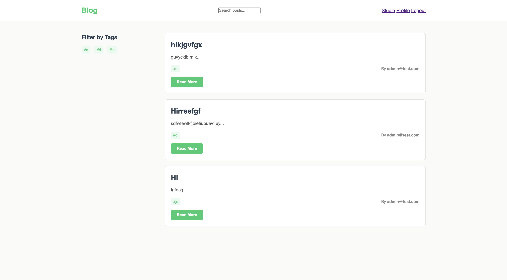
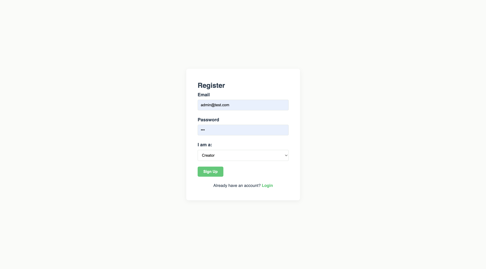
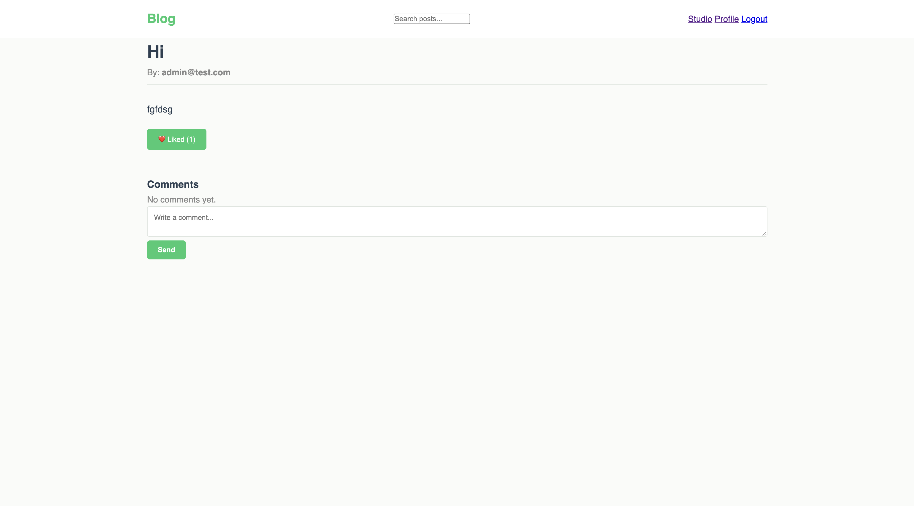
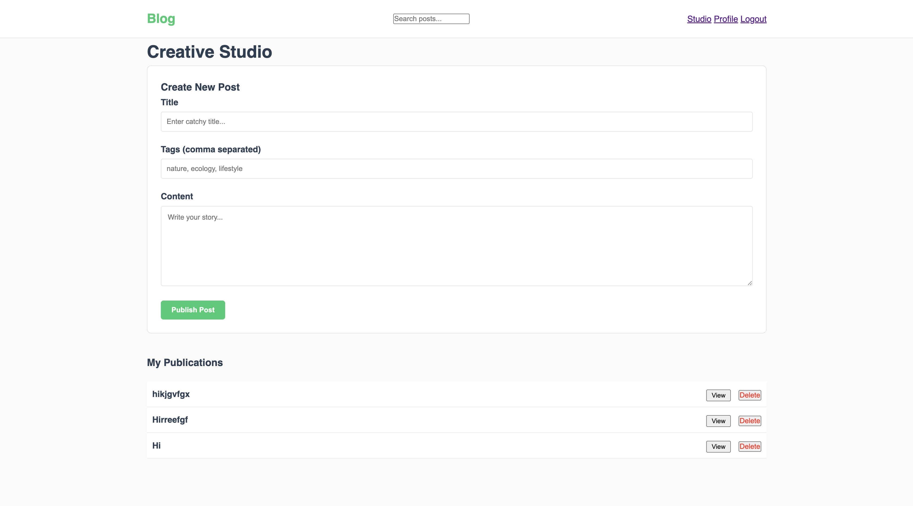
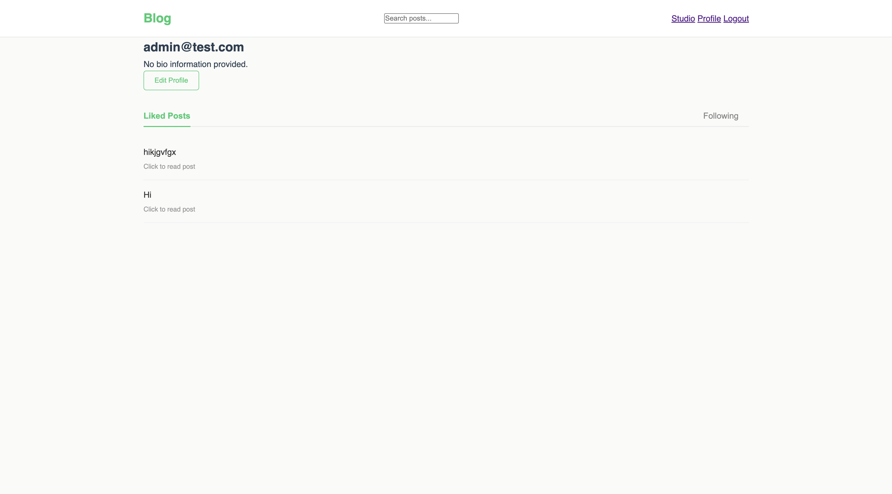

# Blog Project

## Description
A production-ready Full-Stack Blogging application that features secure authentication, dynamic content management, and social interactions. The system is built using an MVC architecture to handle relational data between users, articles, and comments.


## Features
- **JWT Authentication**: Secure user registration and login with token-based authorization.
- **Content Management (CRUD)**: Create, view, and delete posts with support for titles, content, and tags.
- **Interactive Social Tools**: A real-time like toggle system and an interactive comment section for every post.
- **Creator Studio**: A dedicated dashboard for authors to manage their published content.
- **User Profiles**: Personalized profiles with an editable bio and lists of liked content.

## Tech Stack
- **Backend**: Node.js, Express.js
- **Database**: MongoDB, Mongoose (ODM)
- **Frontend**: Vanilla JavaScript (ES6+), HTML5, CSS3
- **Security**: JSON Web Token (JWT), Bcrypt hashing
- **Deployment**: Render

---

## Prerequisites
1. **Node.js & npm installed**: [https://nodejs.org](https://nodejs.org)
2. **MongoDB instance**: A local MongoDB installation or a MongoDB Atlas connection string.
3. **Web Browser**: Chrome, Firefox, or Safari for accessing the interface.

## How to Run

1. Clone the repository
```bash
git clone
```

2. Install dependencies
```bash
npm install
```

3. Configure Environment Variables
   Create a `.env` file in the root directory and add:
```bash
MONGODB_URI="mongodb_connection"
JWT_SECRET="secret_key"
PORT=3000
```

4. Start the server
```bash
npm start
```

5. Access the application
```bash
Open your browser and navigate to http://localhost:3000
```

---

## Project Interface

### 1. Home Page
The main landing page displaying a feed of all published articles with search and tag filtering capabilities.


### 2. Authentication Page
Secure forms for user registration and login used to manage user sessions.


### 3. Single Post View
Detailed view of an article, including the full text, like count, and an interactive comment section.


### 4. Studio Dashboard
A dedicated management area for creators to view their own posts and perform administrative tasks like deletion.


### 5. Profile Page
User profile section where users can view their liked posts and update their personal bio via a modal window.
